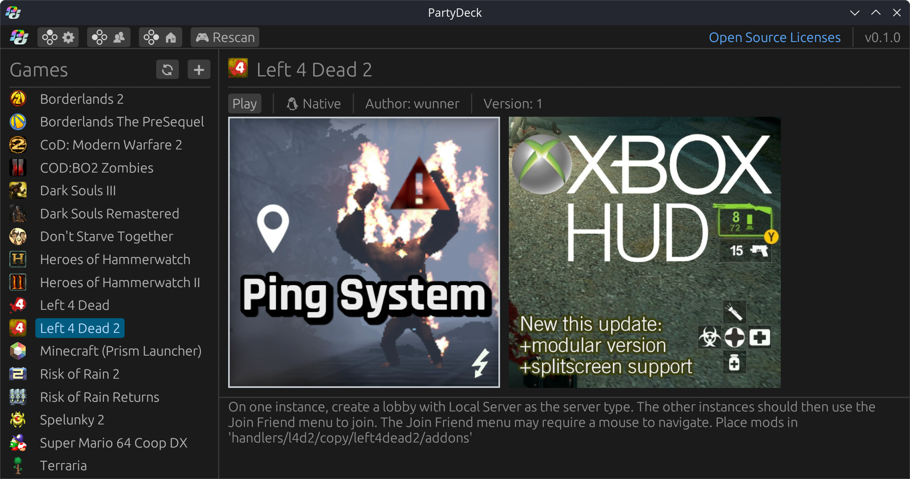
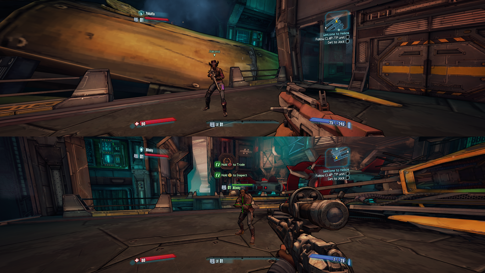

### `PartyDeck`

A split-screen game launcher for Linux/SteamOS

---

<p align="center">
    
    
</p>

> [!IMPORTANT]
> This is the first serious software project I've ever done. It surely contains many violations of software best practices and security flaws; use at your own discretion! If you are experienced in software I would love to know what aspects of the codebase could be improved and how I can do better.

## Features

- Runs up to 4 instances of a game at a time and automatically fits each game window onto the screen
- Supports native Linux games as well as Windows games through Proton
- Handler system that tells the launcher how to handle game files, meaning very little manual setup is required
- Steam multiplayer API is emulated, allowing for multiple instances of Steam games
- Works with most game controllers without any additional setup, drivers, or third-party software
- Now works with multiple keyboards and mice!
- Uses sandboxing software to mask out controllers so that each game instance only detects the controller assigned to it, preventing input interference
- Profile support allows each player to have their own persistent save data, settings, and stats for games
- Works out of the box on SteamOS

## Installing & Usage

Download the latest release [here](https://github.com/wunnr/partydeck-rs/releases) and extract it into a folder. Download game handlers [here](https://drive.proton.me/urls/D9HBKM18YR#zG8XC8yVy9WL).

### SteamOS

SteamOS includes all of PartyDeck's dependencies, but you will need to be on SteamOS 3.7.0 or above for the splitscreen script to work.

If you're in desktop mode, simply run `partydeck-rs`. To use PartyDeck in Gaming Mode, add the script `PartyDeckKWinLaunch.sh` as a non-Steam game by right-clicking that file and selecting "Add to Steam". This is a simple script that launches a KWin session from within Gaming Mode, then runs PartyDeck inside of that session. Then, go into the properties of the non-Steam game and disable Steam Input.

### Desktop Linux

You'll need to install KDE Plasma, Gamescope, and Bubblewrap using your distro's package manager. Then, while in a KDE Plasma session, run `partydeck-rs` to get started. If you're running Steam, make sure none of the controllers are using a Steam Input desktop layout, as Steam Input causes issues such as duplicate controllers being detected.

### Getting Started

On first launch, the app will automatically download UMU Launcher and Goldberg Steam Emu. This may take a while depending on your download speed, but it only needs to be done once.

Once in the main menu, click the + button to add a handler. Create profiles if you want to store save data, and have a look through the settings menu.

## Building

To build PartyDeck, you'll need a Rust toolchain installed with the 2024 Edition. For the mouse/keyboard gamescope build, you'll need Ninja and Meson installed.
Clone the repo with submodules by running `git clone --recurse-submodules https://github.com/wunnr/partydeck-rs.git`. Navigate to the gamescope submodule at `deps/gamescope` and run these commands to build the mouse/keyboard gamescope:

```
git submodule update --init
meson setup build/
ninja -C build/
build/gamescope -- <game>
```

ninja and meson must be able to find development headers for Wayland, Vulkan and
various X11 libraries. On Debian based distros you can install them with:
`sudo apt install libvulkan-dev libwayland-dev libx11-xcb-dev libxcursor-dev \
libxres-dev libxtst-dev libxxf86vm-dev libxi-dev libxmu-dev`.
If your distribution ships an older Wayland (<1.23), append
`--force-fallback-for=wayland,wayland-protocols` to the Meson command so it will
use the bundled copy.

Then, in the main partydeck folder, run `build.sh`. This will build the executable, and place it in the `build` folder, along with the relevant dependencies and resources.


## How it Works

PartyDeck uses a few software layers to provide a console-like split-screen gaming experience:

- **KWin Session:** This KWin Session displays all running game instances and runs a script to automatically resize and reposition each Gamescope window.
- **Gamescope:** Contains each instance of the game to its own window. Also has the neat side effect of receiving controller input even when the window is not currently active, meaning multiple Gamescope instances can all receive input simultaneously
- **Bubblewrap:** Uses bindings to mask out evdev input files from the instances, so each instance only receives input from one specific controller. Also uses directory binding to give each player their own save data and settings within the games.
- **Runtime (Steam Runtime/Proton):** If needed, the app can run native Linux games through a Steam Runtime (currently, 1.0 (scout) and 2.0 (soldier) are supported) for better compatibility. Windows games are launched through UMU Launcher
- **Goldberg Steam Emu:** On games that use the Steam API for multiplayer, Goldberg is used to allow the game instances to connect to each other, as well as other devices running on the same LAN.
- **And finally, the game itself.**

## Known Issues, Limitations and To-dos

- AppImages and Flatpaks are not supported yet for native Linux games. Handlers can only run regular executables inside folders.
- "Console-like splitscreen experience" means single-screen only for now. Multi-monitor support is possible but will require a better understanding of the KWin Scripting API.
- Controller navigation support in the launcher is super primitive; I'd love to try making a more controller-friendly, Big-Picture-style UI in the future, but have no immediate plans for it.
- Games using Goldberg might have trouble discovering LAN games from other devices. If this happens, you can try adding a firewall rule for port 47584. If connecting two Steam Decks through LAN, their hostnames should be changed from the default "steamdeck".

## Credits/Thanks

- @davidawesome02-backup for the [Gamescope keyboard/mouse fork](https://github.com/davidawesome02-backup/gamescope), and Valve for Gamescope
- [@blckink](https://github.com/blckink) for contributions
- MrGoldberg & Detanup01 for [Goldberg Steam Emu](https://github.com/Detanup01/gbe_fork/)
- GloriousEggroll and the rest of the contributors for [UMU Launcher](https://github.com/Open-Wine-Components/umu-launcher)
- Inspired by [Tau5's Coop-on-Linux](https://github.com/Tau5/Co-op-on-Linux) and [Syntrait's Splinux](https://github.com/Syntrait/splinux)
- Talos91 and the rest of the Splitscreen.me team for [Nucleus Coop](https://github.com/SplitScreen-Me/splitscreenme-nucleus), and for helping with handler creation

## Disclaimer
This software has been created purely for the purposes of academic research. It is not intended to be used to attack other systems. Project maintainers are not responsible or liable for misuse of the software. Use responsibly.
